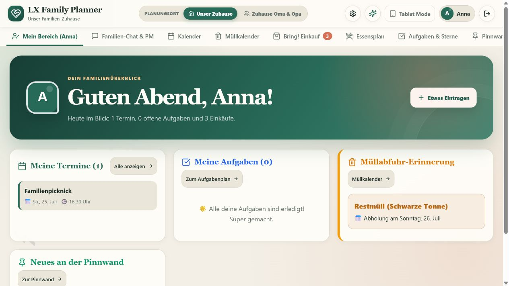
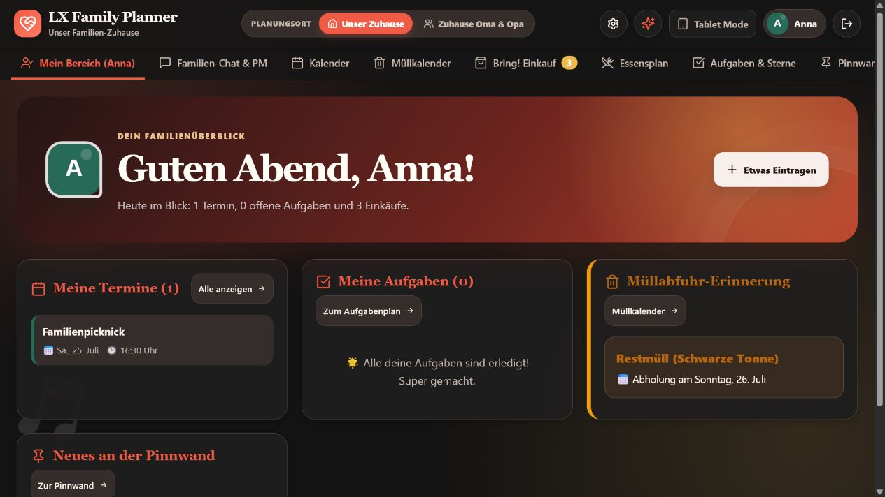
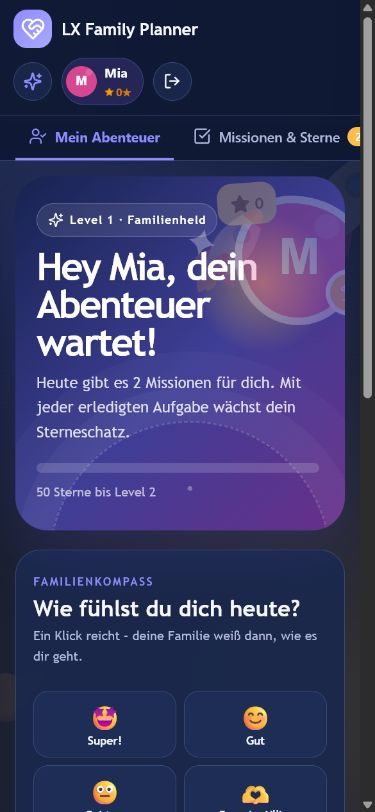
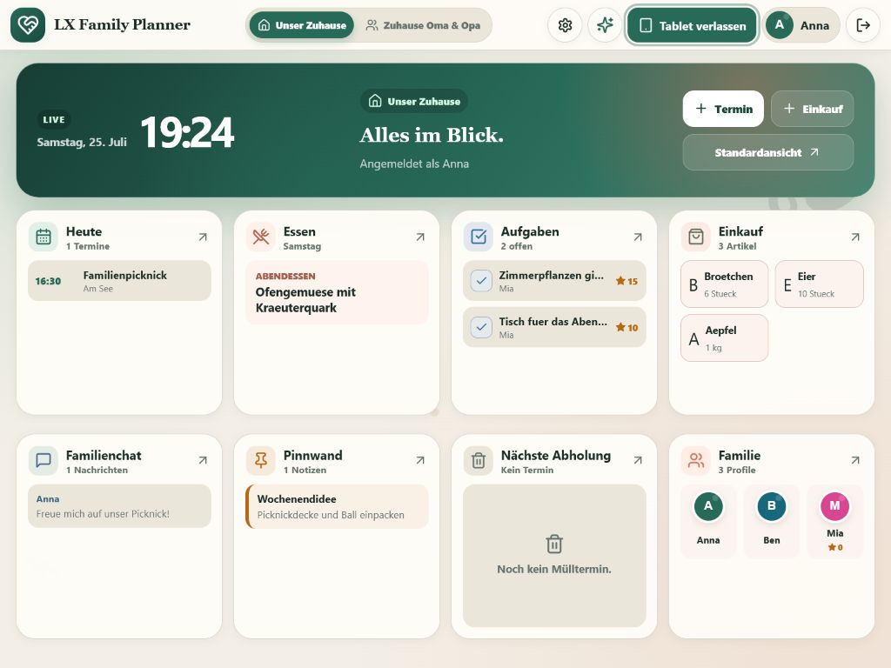
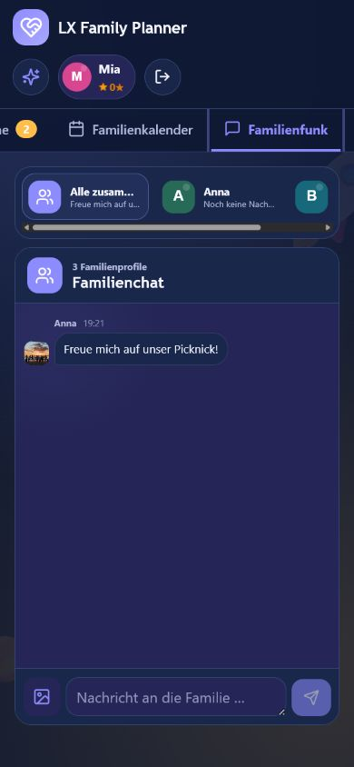

<p align="center">
  
</p>

<h1 align="center">LX Family Planner</h1>

<p align="center">
  Der private Familienraum für Kalender, Aufgaben, Einkauf, Essen, Chat und all die kleinen Dinge dazwischen.
</p>

<p align="center">
  <strong>Aktuelle Version: 1.5.0</strong> ·
  <a href="CHANGELOG.md">Was ist neu?</a>
</p>

Der LX Family Planner ist eine selbst gehostete Familien-App für das eigene
Heimnetz. Erwachsene bekommen einen ruhigen, vollständigen Überblick. Kinder
sehen eine vereinfachte Erlebniswelt mit Missionen, Sternen und eigenen
Themenwelten. Alle Daten bleiben auf dem eigenen Server.

## Ein Blick in die App

| Waldruhe | Backstage |
| --- | --- |
|  |  |

| Kinderprofil | Tablet Mode |
| --- | --- |
|  |  |

<details>
<summary>Mobiler Familienchat</summary>



</details>

## Das ist enthalten

- Familienkonten mit Profilen für Mama, Papa, Kind, Oma, Opa und weitere Rollen
- beliebig viele verwaltete Organisationsprofile ohne eigene Anmeldung, etwa
  für Oma, Opa oder betreute Personen; mit Kalender und Aufgaben, aber ohne
  Chat, Punkte oder Profilwechsel
- kinderleichte Bubble-Profilauswahl und optionaler Profil-PIN
- Kalender mit mehreren Erinnerungen pro Termin, Müllkalender, ICS-Dateiimport
  und automatisch aktualisierte Kalender-Abos
- gemeinsamer Familienchat und geschützte Direktnachrichten
- Einkaufslisten mit großem, alltagstauglichem Produktkatalog und Bring!-Anbindung
- Wochen-Speiseplan, Rezeptbuch, direkter Android-Teilen-Import, sicherer Web-
  und Pinterest-Import und Kochmodus
- Aufgaben, Sterne und Belohnungsshop
- Familienreise mit Morgen-/Abendroutinen, Wochenrückblick, Abzeichen,
  Mutmachern und gemeinsamen Missionen
- geschütztes Taschengeldbuch mit Sparzielen und optionaler
  Sterne-zu-Taschengeld-Umwandlung
- Schulbereich mit Stundenplan, Hausaufgaben, Klassenarbeiten und
  Schulranzen-Checkliste
- Familien-Abstimmungen mit einer Stimme pro Profil
- faire Aufgabenrotation: wiederkehrende Pflichten wechseln automatisch
  zwischen ausgewählten Familienmitgliedern
- Vier-Augen-Prinzip: Kinder melden eine Aufgabe als erledigt, der Ersteller
  bestätigt sie und erst danach werden Sterne gutgeschrieben
- Pinnwand, detailliertes Familiennetz und Stammbaum zwischen angemeldeten
  Familien
- einzeln bestätigte Familienfreigaben für gemeinsame Termine, Aufgaben,
  Sterne, Belohnungen und Taschengeld der Enkelkinder
- native Home-Assistant-Kacheln mit Live-Status, sicheren Aktionen,
  Profilfreigaben und großer Tablet-Ansicht
- Elternzentrale für Profile, Aufgaben, Punktestände, freigegebene YouTube-/
  Spotify-Widgets und Geräte
- eigene Kinderoberfläche mit Raketen-, Einhorn-, Feen-, Dino-, Sonnen- und
  Heldenwelt
- Erwachsenen-Themes von Waldruhe und Küstenruhe bis Backstage und Neon Nacht
- profilgebundene Browser-Benachrichtigungen und optionale Gotify-Anbindung
- einstellbare Benachrichtigungsruhe und Medienzeiten für Kinderprofile
- schnell erreichbare Notfallkarte mit elterngeschützter Bearbeitung
- dauerhaftes, profilgetrenntes Meldungszentrum mit gelesen/ungelesen
- Familien-Posteingang mit persönlichem Tagesüberblick für Termine, Aufgaben,
  Essen und Einkauf
- wiederkehrende Aufgaben für täglich, werktags, wöchentlich und monatlich
- frei anpassbare Dashboard-Kacheln pro Profil und Gerät mit eigener
  Tablet-Anordnung, Sichtbarkeit und kompakter Ansicht
- eigenständiger Tablet Mode mit acht Kacheln für das Querformat
- responsive Darstellung für PC, Tablet und Smartphone
- globaler „Problem melden“-Knopf mit lokaler Verwaltung in der Elternzentrale
- sichtbare Produktversion in den Familieneinstellungen und im Systemstatus

### Profile ohne eigenen Zugang

Erwachsene können in der Profilverwaltung bei einem neuen Profil **Nur von uns
verwaltet** auswählen. Das Profil bleibt anschließend aus der Anmeldung und dem
Profilwechsel ausgeblendet. Im Kalender, in der Aufgabenplanung und in der
Elternzentrale kann es trotzdem wie jede andere Person ausgewählt werden.

Diese Profile sind für reine Organisation gedacht. Sie erhalten keinen Chat,
keine eigenen Push-Geräte, keine Kinderpunkte und keinen eigenen Zugang zum
Familienplaner. Terminerinnerungen für ein verwaltetes Profil gehen automatisch
an die zuständigen Erwachsenen.

### Familienkonten sicher miteinander verbinden

Großeltern mit einem eigenen Familienkonto werden über **Euer Familiennetz**
eingeladen. Nach der gegenseitigen Bestätigung legt jede Familie selbst fest,
was die andere Seite darf:

- Einladungen zu gemeinsam sichtbaren Terminen
- Aufgaben für Kinder und Teenager
- Sternpunkte und eigene Belohnungen
- Taschengeldbuchungen

Private Kalendertermine, Chats, Pinnwandbilder und Zugangsdaten werden dabei
nicht geteilt. Aufgaben eines verbundenen Großelternkontos müssen weiterhin
von einem Erwachsenen im Familienkonto des Kindes bestätigt werden.

### Home Assistant

Home Assistant wird in der **Elternzentrale** verbunden. Benötigt werden die
interne Adresse der Home-Assistant-Instanz und ein langlebiger Zugriffsschlüssel
aus dem Home-Assistant-Profil. Danach werden nur die ausdrücklich ausgewählten
Geräte und Sensoren als Dashboard-Kacheln angezeigt.

Eltern können pro Entität festlegen:

- nur anzeigen oder auch bedienen,
- welche Kinderprofile die Kachel sehen dürfen,
- ob die Integration vorübergehend aktiv ist.

Türschlösser und Alarmanlagen werden nicht freigegeben. Garagentore und
Einfahrten bleiben Erwachsenen vorbehalten und verlangen eine zusätzliche
Bestätigung. Der Zugriffsschlüssel wird verschlüsselt im Backend gespeichert
und niemals an den Browser ausgeliefert.

Bei Docker sollte als Adresse vorzugsweise die feste Heimnetz-IP verwendet
werden, zum Beispiel:

```text
http://192.168.178.50:8123
```

Eine `.local`-Adresse funktioniert abhängig vom Docker- und Netzwerksystem
nicht immer zuverlässig.

## Weg 1: Mit Docker starten (empfohlen)

### Einfach unter Windows

Voraussetzung ist eine laufende Installation von Docker Desktop. Danach genügt
ein Doppelklick auf:

```text
Start-Familienplaner.cmd
```

Das Startskript:

1. erzeugt beim ersten Start eine lokale `.env` mit sicherem Anwendungsschlüssel,
2. übernimmt einen vorhandenen Altbestand nach `data/`,
3. baut den Produktions-Container,
4. startet ihn auf Port `3001`.

Auf dem Server-PC ist die App anschließend unter
`http://localhost:3001` erreichbar. Andere Geräte im selben Heimnetz öffnen:

```text
http://IP-DES-SERVERS:3001
```

Beispiel:

```text
http://192.168.178.40:3001
```

Falls Windows Verbindungen aus dem Heimnetz blockiert, kann
`Heimnetz-Freigabe.cmd` einmal als Administrator ausgeführt werden. Das Skript
erlaubt Port `3001` nur in privaten Netzwerken. Eine Portfreigabe am Router ist
für den reinen Heimnetzbetrieb nicht nötig und wird nicht empfohlen.

Weitere Helfer:

- `Update-Familienplaner.cmd` lädt Updates, prüft sie auf einer Kopie der
  Datenbank und spielt sie mit automatischer Rückfallmöglichkeit ein.
- `Stop-Familienplaner.cmd` beendet die App, ohne Daten zu löschen.
- `Backup-Familienplaner.cmd` erzeugt eine konsistente SQLite-Sicherung.
- Ein erneuter Start baut geänderten Programmcode automatisch neu.

### Docker manuell

```powershell
Copy-Item .env.example .env
```

Danach in `.env` mindestens `APP_SECRET` durch einen langen, zufälligen Wert
ersetzen und starten:

```powershell
docker compose up -d --build
```

Status und Protokoll:

```powershell
docker compose ps
docker compose logs -f family-planner
```

Stoppen:

```powershell
docker compose down
```

Die aktiven Daten liegen in `data/`, Sicherungen in `backups/`. Beide Ordner
werden absichtlich nicht in Git aufgenommen.

## Proxmox VE Helper-Script

Für Proxmox VE gibt es einen eigenen One-Liner. Er wird in der
**Proxmox-Host-Shell als root** ausgeführt und erstellt einen neuen,
unprivilegierten Debian-LXC:

```bash
bash -c "$(curl -fsSL https://raw.githubusercontent.com/laxxx-lab/lx-family-planner/main/scripts/pve-helper.sh)"
```

Vor dem Ausführen kann das Skript vollständig angesehen werden:

```bash
curl -fsSL https://raw.githubusercontent.com/laxxx-lab/lx-family-planner/main/scripts/pve-helper.sh | less
```

Ein Trockenlauf prüft PVE, Speicher, Netzwerk und alle gewählten Werte, erstellt
aber noch keinen Container:

```bash
bash -c "$(curl -fsSL https://raw.githubusercontent.com/laxxx-lab/lx-family-planner/main/scripts/pve-helper.sh)" -- --dry-run
```

Die Standardinstallation verwendet:

- Proxmox VE 8.4 oder neuer
- Debian 13, mit automatischem Rückfall auf Debian 12
- unprivilegierten LXC mit `nesting` und `keyctl`
- 2 CPU-Kerne, 2 GB RAM, 512 MB Swap und 8 GB Speicher
- DHCP an `vmbr0` und Port `3001`
- Docker Engine aus dem offiziellen Docker-Repository
- zufällig erzeugtes App-Geheimnis und persistente Daten im LXC

Im erweiterten Modus lassen sich Container-ID, Speicher, Netzwerk, Ressourcen,
Port und öffentliche LX-Adresse anpassen. Eine bereits vergebene Container-ID
wird niemals überschrieben. Bei einem Installationsfehler bleibt der neue
Container zur Diagnose erhalten.

Nach der Installation:

```bash
pct enter CONTAINER_ID
lx-family status
lx-family update
lx-family backup
lx-family logs
lx-family restart
lx-family domain https://familie.example.de
lx-family doctor
```

Der Helper ist für eine **neue Installation** gedacht. Für den Umzug einer
bestehenden Familie zuerst ein Datenbank-Backup erstellen und dieses
anschließend bewusst in die neue Instanz übernehmen.

## Bequem und sicher aktualisieren

### Docker unter Windows

Ein Doppelklick genügt:

```text
Update-Familienplaner.cmd
```

Das Update läuft bewusst in dieser Reihenfolge:

1. Nur bei einem sauberen Programmordner wird die neue Git-Version geladen.
2. Das bisherige Docker-Abbild wird als Rückfallversion vorgemerkt.
3. Die neue Version wird gebaut, während der Planer noch erreichbar bleibt.
4. Danach wird die App kurz angehalten und eine konsistente SQLite-Sicherung
   samt Prüfmanifest erstellt.
5. Alle Datenbankmigrationen laufen zuerst auf einer temporären Kopie dieser
   Sicherung.
6. Erst nach erfolgreicher Simulation startet die neue Version.
7. Abschließend werden alle bereits vorhandenen Datensätze und gespeicherten
   Einstellungen mit dem Stand vor dem Update verglichen.

Schlägt Start, Migration, Gesundheitscheck oder Datenvergleich fehl, stellt das
Skript automatisch die vorherige Docker-Version und die Sicherung wieder her.

Lokale Änderungen an Programmdateien werden nicht überschrieben. In diesem Fall
bricht das Update mit einer Erklärung ab. Absichtlich lokal bereitgestellter
Quellcode kann ohne Git-Abruf aktualisiert werden:

```powershell
powershell -File scripts/docker-update.ps1 -SkipPull
```

### Docker unter Linux

Im Projektordner:

```bash
bash scripts/docker-update.sh
```

Ohne Git-Abruf:

```bash
bash scripts/docker-update.sh --skip-pull
```

### Ohne Docker

Vor dem Austausch des Programmcodes:

```powershell
npm run backup
git pull --ff-only
npm ci
npm run check
```

Danach den laufenden Node-Prozess beziehungsweise den verwendeten Systemdienst
neu starten und prüfen:

```powershell
npm run audit
```

Die `.env` darf bei einem Update nicht ersetzt werden. Insbesondere
`APP_SECRET` muss gleich bleiben, weil damit Bring!, Gotify, Home Assistant,
private Kalenderlinks und Push-Schlüssel verschlüsselt werden.

### Was erhalten bleibt

Der Docker-Updater behält den Ordner `data/` als unabhängiges Volume. Das
Prüfmanifest kontrolliert unter anderem:

- Familienkonten, Profile, Rollen, PINs, Sterne und Profil-Themes
- Routinen, Taschengeldbuchungen, Sparziele, Schuleinträge und Abstimmungen
- Familien-Missionen, Mutmacher, Abzeichenfortschritt und Kinder-Begleiter
- Ruhezeiten, Medienzeitfenster und Notfallkontakte
- Kalendertermine, Aufgaben, Einkauf, Speisepläne und Mülltermine
- importierte Rezepte einschließlich Zutaten, Zubereitung und Bildern
- Pinnwandnotizen und Pinnwandbilder
- Chat, Familiennetz, Familienfreigaben, gemeinsame Termine, Medienlinks und
  Dashboard-Inhalte
- Kalender-Abos, Bring!, Gotify, Home Assistant und deren verschlüsselte
  Konfiguration
- lokal gespeicherte Problemmeldungen und ihr Bearbeitungsstatus
- Push-Geräte, Benachrichtigungseinstellungen und Familien-Posteingang

Gerätespezifische Komfortwerte wie das zuletzt aktive Profil, der ausgewählte
Haushalt, die Reihenfolge der Dashboard-Kacheln und ein zurückgestellter
Benachrichtigungshinweis liegen im Browser. Ein Update löscht diesen Speicher
nicht. Dafür müssen Adresse und Port der App gleich bleiben.

## Weg 2: Ohne Docker starten

Voraussetzungen:

- Node.js 22.13 oder neuer
- npm

Einmalig vorbereiten:

```powershell
Copy-Item .env.example .env
npm ci
npm run build
```

`APP_SECRET` in `.env` vor dem ersten produktiven Start durch einen langen,
zufälligen Wert ersetzen. Danach:

```powershell
npm start
```

Die App läuft unter `http://localhost:3001`.

Für die Entwicklung werden zwei Terminals verwendet:

```powershell
npm run server
```

```powershell
npm run dev
```

Vite läuft dann unter `http://localhost:3000` und leitet API-Anfragen an den
Server auf Port `3001` weiter.

## Externe Kalender verbinden

Eltern und Großeltern können im Familienkalender unter **Kalenderquellen**
veröffentlichte ICS-Links aus Google Kalender, Outlook, Nextcloud und anderen
Kalenderdiensten hinterlegen. Die Verbindung ist bewusst nur lesend:

- der geheime Kalenderlink wird verschlüsselt in SQLite gespeichert,
- Termine werden standardmäßig einmal pro Stunde aktualisiert,
- wiederkehrende Termine, Ausnahmen, Ganztagstermine und Zeitzonen werden
  berücksichtigt,
- abonnierte Termine sind im Familienplaner als schreibgeschützt markiert,
- bei einem Verbindungsfehler bleiben die zuletzt erfolgreich gelesenen
  Termine erhalten.

Kalender auf privaten Heimnetz-Adressen sind aus Sicherheitsgründen zunächst
gesperrt. Für einen lokalen Nextcloud- oder CalDAV-Server kann in `.env`
bewusst freigeschaltet werden:

```text
CALENDAR_ALLOW_PRIVATE_HOSTS=true
```

Link-Local- und Loopback-Adressen bleiben trotzdem gesperrt. Das
Aktualisierungsintervall lässt sich mit
`CALENDAR_SYNC_INTERVAL_MINUTES=60` anpassen.

## Terminerinnerungen

Beim Anlegen eines Termins lassen sich mehrere Erinnerungen kombinieren, zum
Beispiel **1 Tag**, **10 Stunden**, **1 Stunde** und **10 Minuten vorher**.
Eigene Termine können später über das Glockensymbol im Kalender angepasst
werden.

Die Prüfung läuft auf dem Server und nicht nur im geöffneten Browser:

- der Hinweis erscheint im Familien-Posteingang,
- Geräte mit aktiviertem Web-Push erhalten eine Systemmeldung,
- ein verbundener Gotify-Server kann die Erinnerung ebenfalls zustellen,
- bereits verschickte Erinnerungen werden in SQLite vermerkt und nicht doppelt
  gesendet,
- nach einer kurzen Serverpause wird nur der sinnvollste noch offene Hinweis
  nachgeholt.

Docker verwendet standardmäßig `Europe/Berlin`. Eine andere Zeitzone kann über
`TZ` in der `.env` gesetzt werden.

## Rezepte aus dem Web importieren

Der Rezept-Finder liest öffentliche HTTPS-Seiten mit Schema.org- oder
h-recipe-Daten. Dadurch funktionieren neben Chefkoch, Lecker und vielen
weiteren Rezeptportalen auch Pinterest-Pins, die auf eine öffentliche
Original-Rezeptseite verweisen. Bei Pins mit direkt hinterlegten Zutaten wird
der lesbare Inhalt übernommen und gegebenenfalls mit einem Prüfhinweis
gekennzeichnet.

Zum Schutz des Heimnetzes öffnet der Import keine privaten oder lokalen
Netzwerkadressen, keine Links mit eingebetteten Zugangsdaten und keine Seiten
hinter einem Login. Portale, die automatisierte Aufrufe vollständig blockieren,
müssen weiterhin manuell ins Kochbuch übertragen werden.

### Rezept direkt aus Chefkoch oder Pinterest teilen

Sowohl die installierte LX-PWA als auch die Android-App registrieren sich auf
unterstützten Android-Geräten als Teilen-Ziel. Danach funktioniert der Ablauf
ohne Kopieren:

1. LX Family Planner über die HTTPS-Adresse öffnen.
2. Im Browser **Zum Startbildschirm hinzufügen** beziehungsweise **App
   installieren** wählen.
3. In Chefkoch, Pinterest oder einer anderen Rezept-App **Teilen** öffnen.
4. **LX Familie** auswählen.

LX öffnet das Kochbuch, liest den geteilten Link und startet den sicheren
Rezeptimport. Die Funktion ist von der Web-Share-Target-Unterstützung des
Geräts abhängig; auf Android mit der LX-App oder einer installierten
Chromium-PWA ist sie am zuverlässigsten. Ohne Installation bleibt das Einfügen
eines Links im Rezept-Finder weiterhin möglich.

### Android-App herunterladen und bauen

Auf der öffentlichen Anmeldeseite zeigt LX automatisch die aktuelle
Android-App mit Versionsnummer, Dateigröße, Download-Knopf und QR-Code an. Der
QR-Code verweist immer auf die eigene Planer-Adresse, zum Beispiel
`https://familie.example.de/apk/latest.apk`.

Bei einem Aufruf über `localhost` wird bewusst kein QR-Code angezeigt, weil
`localhost` auf dem Handy das Handy selbst bezeichnet. Für lokale Tests die
Heimnetz-IP des Servers verwenden oder `PUBLIC_APP_URL` in `.env` auf die
öffentliche HTTPS-Adresse setzen.

Für einen neuen App-Build genügt unter Windows:

```powershell
npm run build:apk
```

Das fertige Paket liegt anschließend als `LX-Family-Planner.apk` im
Projektordner. Beim ersten Durchlauf erzeugt das Skript automatisch einen
privaten Release-Schlüssel unter `data/android-signing/`. Danach verwendet
jeder Build denselben Schlüssel, damit Android spätere Versionen als Update
akzeptiert.

> **Wichtig:** `data/android-signing/` einmal sicher außerhalb des Servers
> sichern. Geht dieser Schlüssel verloren, können bestehende App-Installationen
> nicht mehr mit einer neu signierten APK aktualisiert werden.

Eine vorhandene professionelle Signatur kann stattdessen über diese lokalen
Variablen vorgegeben werden:

```text
LX_ANDROID_KEYSTORE
LX_ANDROID_STORE_PASSWORD
LX_ANDROID_KEY_ALIAS
LX_ANDROID_KEY_PASSWORD
```

Keystore und Passwörter werden nicht in Git aufgenommen. Die fertige,
signierte APK wird zusätzlich unter `public/apk/latest.apk` bereitgestellt und
ist damit Bestandteil des nächsten Docker- beziehungsweise Server-Updates. In
der App kann über das Server-Symbol eine andere HTTPS-Domain oder eine
Heimnetz-IP ausgewählt werden.

Der Build wird außerdem nach `data/apk/latest.apk` kopiert. Läuft der
Familienplaner aus demselben Projektordner beziehungsweise mit dem
Docker-Volume `data/`, weist eine ältere Android-App automatisch auf die neue
Version hin. Produktionsserver bieten ausschließlich signierte Release-Pakete
an.

## Benachrichtigungen

### Browser-Push

Browser-Benachrichtigungen werden pro Familienprofil und Gerät gespeichert. Ein
Gerät kann mehreren Profilen zugeordnet sein; in den Profileinstellungen lassen
sich einzelne Meldungsarten an- und ausschalten.

Unabhängig davon landen wichtige Ereignisse zusätzlich im profilgetrennten
Familien-Posteingang der App. Der Reiter **Heute** bündelt Termine, fällige
Aufgaben, Elternfreigaben, Speiseplan und Einkauf passend zum aktiven Profil.
Im Reiter **Meldungen** bleiben Aufgabenfreigaben, Termine und Chatnachrichten
nachvollziehbar, auch wenn ein Browser-Push nicht zugestellt wurde.
Gelesen/ungelesen wird zwischen den Geräten synchronisiert; alte Meldungen
werden nach 90 Tagen automatisch entfernt.

Echte Benachrichtigungen im Hintergrund benötigen eine vertrauenswürdige
HTTPS-Adresse. Eine reine Heimnetz-Adresse wie `http://192.168.x.x:3001` genügt
den Browsern dafür nicht. Empfohlen ist ein Reverse Proxy wie Caddy, Traefik
oder nginx vor Port `3001`. Die Adresse kann über internes DNS trotzdem auf das
Heimnetz beschränkt bleiben.

Auf Android ist dafür keine eigene native App erforderlich: Chrome und andere
kompatible Browser empfangen Web Push über den Service Worker auch dann, wenn
der Familienplaner gerade nicht geöffnet ist. Für die zuverlässigste
Zustellung den Planer über die HTTPS-Adresse öffnen, über **Zum
Startbildschirm hinzufügen** installieren und anschließend in der
Elternzentrale das aktuelle Gerät für das gewünschte Profil anmelden. Zusätzlich
müssen Android-Benachrichtigungen für die installierte Web-App erlaubt sein.

Auf iPhone und iPad muss die App zuerst zum Home-Bildschirm hinzugefügt und von
dort geöffnet werden.

### Gotify, Telegram und WhatsApp

- **Gotify:** bereits als unabhängiger Elternkanal integriert.
- **Telegram:** sinnvollster nächster Kanal. Geplant ist eine einmalige
  Profilkopplung über QR-/Start-Link zu einem Familien-Bot, ohne dass Kinder
  Tokens eingeben müssen.
- **WhatsApp:** technisch nur über die offizielle WhatsApp Business Platform
  vorgesehen. Eine Kopplung eines privaten WhatsApp-Kontos über inoffizielle
  Web-Sitzungen gehört bewusst nicht zum Produktionskonzept.

## Sicherheit und Daten

- Passwörter und Profil-PINs werden nicht im Klartext gespeichert.
- Sitzungen verwenden ein `HttpOnly`-Cookie.
- Familien und Direktnachrichten werden serverseitig voneinander isoliert.
- Bring!-Zugangsdaten, private Kalenderlinks und Push-Schlüssel werden mit
  `APP_SECRET` verschlüsselt.
- Der Docker-Container läuft ohne Root-Rechte, mit schreibgeschütztem
  Dateisystem, ohne Linux-Capabilities und mit `no-new-privileges`.
- Ohne `AGENT_API_KEY` bleibt die optionale Agent-Schnittstelle deaktiviert.
- SQLite läuft im WAL-Modus und kritische Punktebuchungen sind transaktional.

Wichtig: Wer `APP_SECRET` später ändert, muss verschlüsselte Integrationen wie
Bring! erneut verbinden.

## Backups

Mit Docker:

```text
Backup-Familienplaner.cmd
```

Ohne Docker:

```powershell
npm run backup
```

Zu jeder neuen `.sqlite`-Sicherung wird eine Datei
`.sqlite.manifest.json` angelegt. Sie enthält keine Passwörter oder
Integrationstokens, sondern Prüfsummen, Datensatzkennungen und
Integritätsergebnisse. Damit kann nach einem Update erkannt werden, ob ein
bestehender Eintrag oder ein gespeichertes Einstellungsfeld fehlt oder verändert
wurde.

Sicherungen sollten regelmäßig zusätzlich auf ein anderes Gerät oder Medium
kopiert werden. Ein Backup ist erst dann ein gutes Backup, wenn die
Wiederherstellung einmal getestet wurde.

## Konfiguration

Die Vorlage liegt in `.env.example`.

| Variable | Bedeutung |
| --- | --- |
| `APP_SECRET` | Pflicht in Produktion; verschlüsselt sensible lokale Daten |
| `PORT` | interner Server-Port, Standard `3001` |
| `HOST_PORT` | Port des Docker-Hosts, Standard `3001` |
| `PUBLIC_APP_URL` | öffentliche HTTPS-Adresse für App-Download und QR-Code |
| `DATABASE_FILE` | abweichender Pfad zur SQLite-Datenbank |
| `LEGACY_DATABASE_FILE` | optionaler JSON-Altbestand für die erste Migration |
| `EVENT_REMINDER_INTERVAL_SECONDS` | Prüfintervall für fällige Terminerinnerungen |
| `CORS_ALLOWED_ORIGINS` | zusätzliche, vertrauenswürdige Ursprünge für eine getrennt gehostete oder native Oberfläche |
| `AGENT_API_KEY` | aktiviert optional die geschützte Agent-API |
| `VAPID_*` | optionale feste Web-Push-Schlüssel |

## Qualität prüfen

```powershell
npm run check
```

Der Befehl prüft die Serverdateien, führt den isolierten API-Smoke-Test aus und
erstellt einen vollständigen Produktions-Build.

Nur die aktive Datenbank kontrollieren:

```powershell
npm run audit
```

## Architektur

```text
Browser / PWA
    │
    ├── React-Oberfläche und rollenabhängige Themes
    ├── Service Worker für Web Push
    │
    ▼
Express API
    ├── Sitzungen und Berechtigungen
    ├── Familien-, Profil- und Integrationslogik
    ├── geschützter Echtzeit-Ereigniskanal
    │
    ▼
SQLite
    ├── Familienisolierte Daten
    ├── verschlüsselte Integrationswerte
    └── transaktionale Aufgaben- und Punktebuchungen
```

Wichtige Bereiche:

- `server/app.js` – HTTP-API, Sitzungen, Berechtigungen und Integrationen
- `server/database.js` – Schema, Migrationen und Transaktionen
- `src/context/FamilyContext.jsx` – zentraler Client-Datenzugriff
- `src/components/Auth` – Anmeldung und Familienkonto
- `src/components/Dashboard` – Erwachsenen-, Kinder- und Tablet-Dashboard
- `src/index.css` – Theme-System und responsive Produktoberfläche

## Projektstatus

Der Planer ist für den privaten, selbst gehosteten Familienbetrieb ausgelegt.
Vor Aktualisierungen sollte immer ein Backup erstellt werden. Zugang aus dem
öffentlichen Internet sollte nur über HTTPS, einen Reverse Proxy und eine
bewusst konfigurierte Zugriffsschicht erfolgen.
